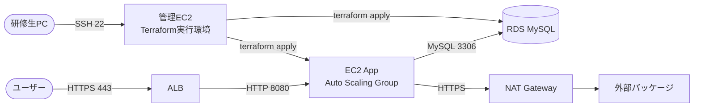

# VPC・ネットワーク設計

> **対象システム:** shop-app（商品一覧・カート機能）
> **リージョン:** ap-northeast-1（東京）

---

## VPC 構成（空間レイアウト）

```
┌──────────────────────────────────────────────────────┐
│  VPC  10.0.0.0/16   (ap-northeast-1)                 │
│                                                       │
│  ┌────────────────────────────────────────────────┐  │
│  │  パブリックサブネット                           │  │
│  │  10.0.0.0/24 (1a)  /  10.0.1.0/24 (1c)        │  │
│  │  ALB,  NAT Gateway,  管理EC2                   │  │
│  └────────────────────────────────────────────────┘  │
│  ┌────────────────────────────────────────────────┐  │
│  │  プライベート・アプリ層                         │  │
│  │  10.0.10.0/24 (1a)  /  10.0.11.0/24 (1c)       │  │
│  │  EC2 App Server（Auto Scaling Group）          │  │
│  └────────────────────────────────────────────────┘  │
│  ┌────────────────────────────────────────────────┐  │
│  │  プライベート・DB 層                            │  │
│  │  10.0.20.0/24 (1a)  /  10.0.21.0/24 (1c)       │  │
│  │  RDS MySQL（インターネット経路なし）            │  │
│  └────────────────────────────────────────────────┘  │
└──────────────────────────────────────────────────────┘
```

## 通信フロー



> **管理EC2 の役割:** 研修生はここに SSH してから `terraform apply` を実行する。
> ローカル PC に AWS 認証情報を設定しなくてよいため、研修環境として管理しやすい。

---

## サブネット一覧

| 名前 | CIDR | AZ | 用途 | インターネット経路 |
|---|---|---|---|---|
| public-1a | 10.0.0.0/24 | 1a | ALB、NAT Gateway、管理EC2 | IGW 直接 |
| public-1c | 10.0.1.0/24 | 1c | ALB | IGW 直接 |
| app-1a | 10.0.10.0/24 | 1a | EC2 App Server | NAT Gateway 経由 |
| app-1c | 10.0.11.0/24 | 1c | EC2 App Server | NAT Gateway 経由 |
| db-1a | 10.0.20.0/24 | 1a | RDS プライマリ | **なし** |
| db-1c | 10.0.21.0/24 | 1c | RDS スタンバイ | **なし** |

---

## セキュリティグループ設計

| SG 名 | アタッチ先 | インバウンド | アウトバウンド |
|---|---|---|---|
| shop-alb-sg | ALB | 443/tcp 0.0.0.0/0 | 8080/tcp → shop-app-sg |
| shop-app-sg | EC2 App | 8080/tcp ← shop-alb-sg | 3306/tcp → shop-db-sg, 443/tcp → 0.0.0.0/0 |
| shop-db-sg | RDS | 3306/tcp ← shop-app-sg | **なし** |
| shop-mgt-sg | 管理EC2 | 22/tcp ← 研修ネットワーク CIDR | 全許可 |

> **shop-mgt-sg のインバウンド:** `0.0.0.0/0` は禁止。研修会場のグローバル IP を CIDR で指定する。

---

## Terraform 定義（抜粋）

```hcl
# vpc.tf

module "vpc" {
  source  = "terraform-aws-modules/vpc/aws"
  version = "~> 5.8"

  name = "shop-vpc"
  cidr = "10.0.0.0/16"

  azs              = ["ap-northeast-1a", "ap-northeast-1c"]
  public_subnets   = ["10.0.0.0/24", "10.0.1.0/24"]
  private_subnets  = ["10.0.10.0/24", "10.0.11.0/24"]
  database_subnets = ["10.0.20.0/24", "10.0.21.0/24"]

  enable_nat_gateway   = true
  single_nat_gateway   = true
  enable_dns_hostnames = true

  tags = local.common_tags
}
```

---

## 設計上の禁止事項

- DB サブネットに NAT Gateway やインターネット経路を追加しない
- `shop-db-sg` にアウトバウンドルールを追加しない
- `shop-mgt-sg` のインバウンドに `0.0.0.0/0` を許可しない（22番ポートは必ず IP 制限）
- アプリサーバーにパブリック IP を割り当てない（ALB 経由のアクセスのみ）
