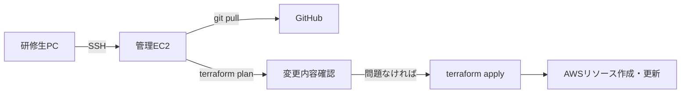

# デプロイ・運用設計

---

## デプロイフロー



### 手順

```bash
# 1. 管理EC2 に SSH
ssh -i ~/.ssh/shop-training.pem ec2-user@<管理EC2のパブリックIP>

# 2. 最新コードを取得
cd ~/aws-infra
git pull origin master

# 3. 変更内容を確認（必ず apply 前に実行）
cd terraform/environments/dev
terraform plan

# 4. 適用
terraform apply

# 5. 研修終了時：リソース削除
terraform destroy
```

> **`terraform plan` は必ず実行すること。**
> apply 前に何が変わるかを確認する習慣をつける。
> 意図しないリソースの削除・変更が含まれていないかチェックする。

---

## Terraform 状態管理（state）

Terraform は作成したリソースの状態を `terraform.tfstate` に記録する。  
複数人で作業する場合、state をローカルに置くと競合するため S3 で共有する。

```hcl
# terraform/environments/dev/backend.tf

terraform {
  backend "s3" {
    bucket         = "shop-tfstate-<account_id>"
    key            = "dev/terraform.tfstate"
    region         = "ap-northeast-1"
    dynamodb_table = "shop-tfstate-lock"  # 同時実行を防ぐロック
  }
}
```

> **state ファイルは直接編集しない。**
> 壊れると Terraform がリソースを管理できなくなる。

---

## インシデント対応

### よく使う確認コマンド

```bash
# EC2 インスタンスの状態確認
aws ec2 describe-instances \
  --filters "Name=tag:Name,Values=shop-app-*" \
  --query 'Reservations[].Instances[].[InstanceId,State.Name]'

# ALB のターゲットヘルスチェック確認
aws elbv2 describe-target-health \
  --target-group-arn <ターゲットグループARN>

# RDS の状態確認
aws rds describe-db-instances \
  --db-instance-identifier shop-db

# CloudWatch Logs でアプリエラーを確認
aws logs filter-log-events \
  --log-group-name /shop/app \
  --filter-pattern "ERROR"
```

### ロールバック手順

Terraform で前のバージョンに戻す場合は、コードを git で戻してから再 apply する。

```bash
# 1つ前のコミットに戻す例
git revert HEAD
terraform plan   # 変更内容を確認
terraform apply
```

---

## 設計上の禁止事項

- `terraform apply` を `plan` 確認なしで実行しない
- state ファイルを直接編集しない
- 管理EC2 で root ユーザーとして terraform を実行しない（ec2-user を使う）
- 研修終了後に `terraform destroy` を忘れない
